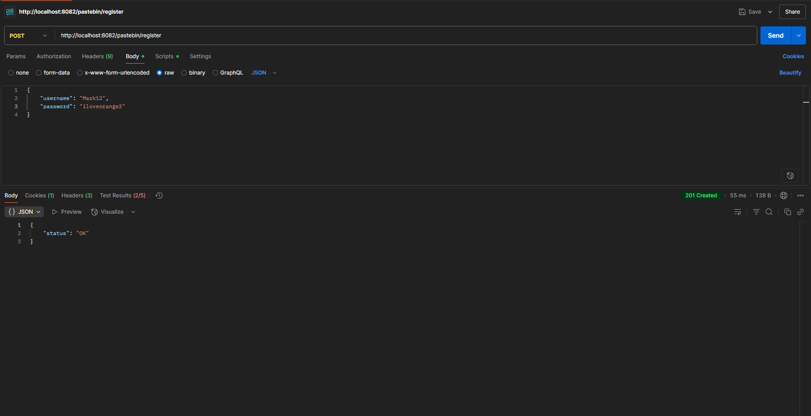
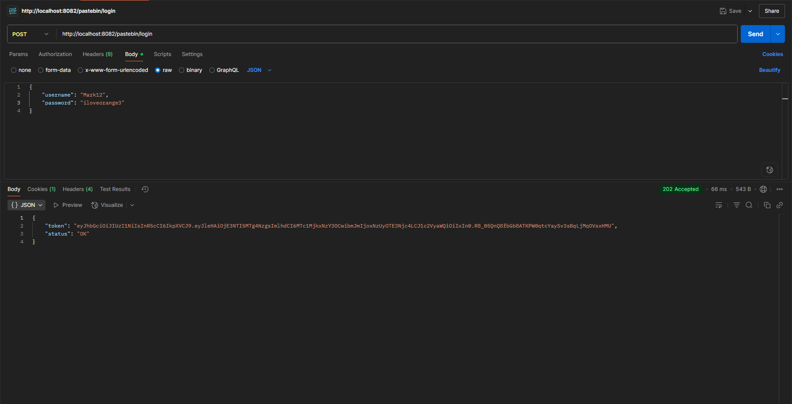
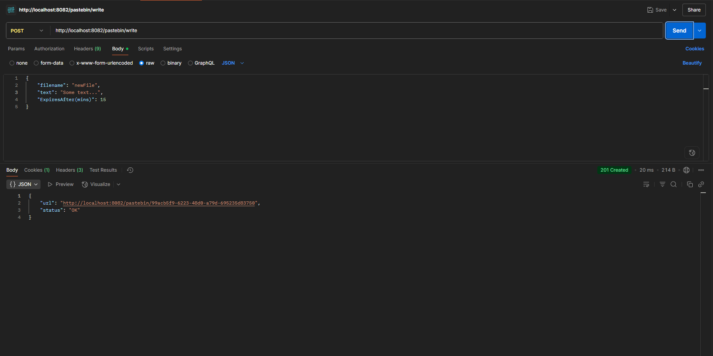
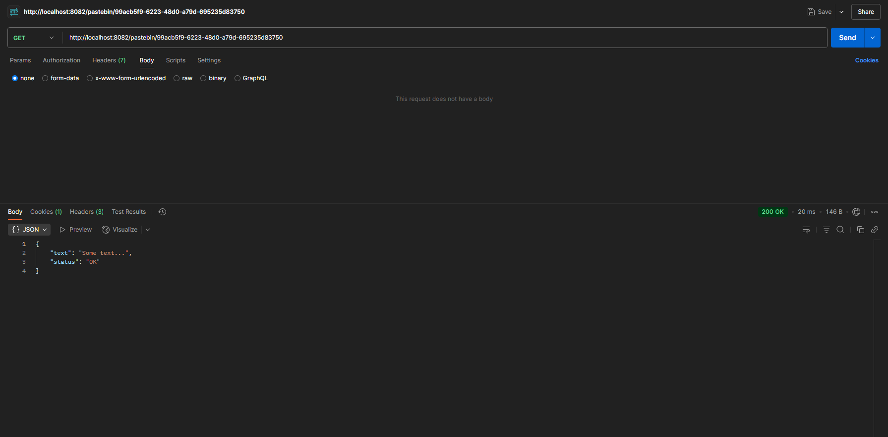

# Pastebin
This is a pet-project Pastebin API, that features writing blocks of text, saving them and getting a link for them as well. When you follow the link, you see the textblock itself.

## Table of contents
* [Introduction](#introduction)
* [Installation](#installation)
* [Quick start](#quick-start)
* [Usage](#usage)
* [Known issues and limitations](#known-issues-and-limitations)

## Introduction
The main goal of this project was to practice using some new techologies for me, such as MinIO and Redis cache. I believe, that I succeeded in this. The project isn't meant to solve real problems, but it might be useful in some ways.

## Installation

### Prerequisites
* [Go](https://go.dev/doc/install) v1.24.2
* [Docker Engine](https://docs.docker.com/engine/install/)
* [Postman](https://www.postman.com/downloads/) (optionally)

### Installing the project
To install the project, simply use this command:

* Clone the repository:
```bash
git clone https://github.com/MKode312/Pastebin_go.git
```

## Quick start

### Running
To start the system, use the following commands:

* Change directory:
```bash
cd Pastebin_go
```

* Install all missing dependencies if there are some:
```bash
go mod tidy
```

* Run the redis-cache docker-container:
```bash
docker run --name redis-server -p 6379:6379 redis:latest
```

* Run the main docker-container:
```bash
docker-compose up
```

* Run the MinIO client:
```bash
go run cmd/minio/main.go
```

* Run the API:
```bash
go run cmd/pastebin/main.go
```
### Using the system
1. To create a profile, you need to send a POST request to this URL: [http://localhost:8082/pastebin/register](http://localhost:8082/pastebin/register)

Example request:
<p align="center">
<br>
</p>

2. To login, send a POST request to this URL: [http://localhost:8082/pastebin/login](http://localhost:8082/pastebin/login)

Example request:
<p align="center">
<br>
</p>

3. To save a textblock, send a POST request to this URL: [http://localhost:8082/pastebin/write](http://localhost:8082/pastebin/write)

Example request:
<p align="center">
<br>
</p>

4. To get a textblock, send a GET request to URL, which you recieved in the previous step.

Example request:
<p align="center">
<br>
</p>

## Usage
Now, more about the API and it's functionality. All the links that are created are pretty short and unique, so you will never get the same URLs for different textblocks.

When you login, you are given the JWT authorization token. It is automatically saved in the cookie called "auth_token", since there is a middleware, that checks your token every single time you try to save the textblock or get it. The JWT token expires after 20 minutes, so you will need to login again to get a new one.

Also, when you are writing your text, you can set the expiration time for your textblock and the link for it. Just use the field in the JSON POST request body called "ExpiresAfter(mins)". Basically, the minimum expiration time is 1 minute.


## Known issues and limitations
There are several errors you can encounter. For instance, you obviously cannot login into account, which isn't created. Or if you try to get a textblock, which is expired, you get the error. Check the time you have set as the expiration time. 

Speaking of the Redis cache, it has the limitation for 100mb, so you cannot save a textblock with size, which is greater than 100mb.

If you encounter some unknown issues, please write about them in "Issues" in my GitHub repository.
